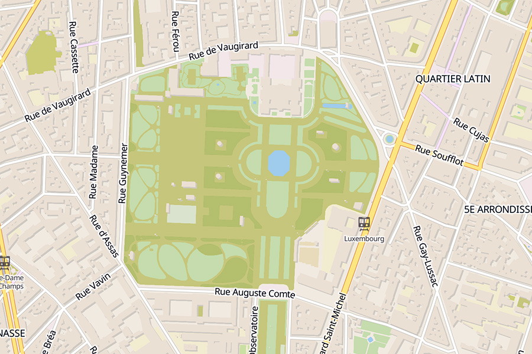
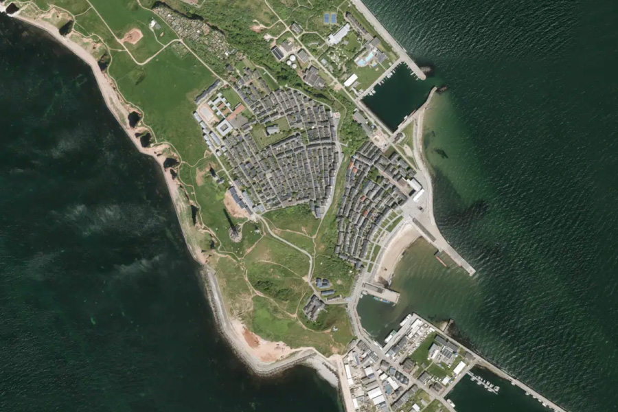
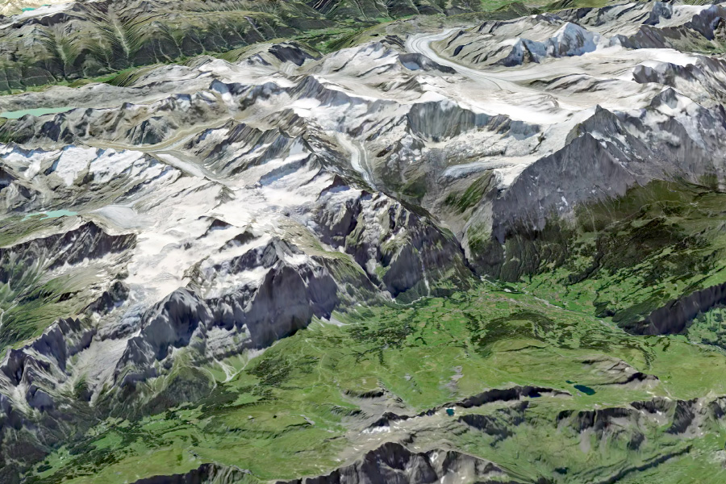

# VersaTiles

**Self-host the whole map stack.** 
No API keys, no per-view fees, no vendor lock-in.

[Documentation](https://docs.versatiles.org/) · [Downloads](https://download.versatiles.org/) · [Playground](https://versatiles.org/playground/) · [versatiles.org](https://versatiles.org)

<table>
<tr>
<td></td>
<td></td>
<td></td>
</tr>
<tr>
<td align="center"><b>Vector styles</b></td>
<td align="center"><b>Satellite</b></td>
<td align="center"><b>3D terrain</b></td>
</tr>
</table>

## Run your own tile server

Our **[setup wizard](https://versatiles.org/tools/setup_server)** assembles the exact commands for your machine. Pick your platform, data and frontend, then copy and paste.

## Free data

Download planet-scale OpenStreetMap, satellite imagery, elevation, hillshading, landcover and bathymetry at **[download.versatiles.org](https://download.versatiles.org/)**.

## Used in production

Newsrooms, transit agencies, researchers and public bodies run their maps on VersaTiles. See the [showcase gallery](https://docs.versatiles.org/showcases/) for 70+ live projects.

## Where to look

| I want to…                             | Use                                                                                                                                                                                                                              |
|----------------------------------------|----------------------------------------------------------------------------------------------------------------------------------------------------------------------------------------------------------------------------------|
| **Serve tiles**                        | [versatiles-rs](https://github.com/versatiles-org/versatiles-rs) · [versatiles-docker](https://github.com/versatiles-org/versatiles-docker) · [node-versatiles-server](https://github.com/versatiles-org/node-versatiles-server) |
| **Build a web map**                    | [versatiles-frontend](https://github.com/versatiles-org/versatiles-frontend) · [versatiles-style](https://github.com/versatiles-org/versatiles-style) · [styler](https://github.com/versatiles-org/maplibre-versatiles-styler)   |
| **Make my own tiles** from OSM         | [Planetiler + Shortbread](https://github.com/versatiles-org/versatiles-docker/tree/main/versatiles-planetiler) · [guide](https://docs.versatiles.org/guides/generate_tiles_from_osm)                                             |
| **Deploy publicly** with CDN and nginx | our production setup at [tiles.versatiles.org](https://github.com/versatiles-org/tiles.versatiles.org)                                                                                                                           |
| Understand the file format             | [versatiles-spec](https://github.com/versatiles-org/versatiles-spec)                                                                                                                                                             |
| Read the fine manual                   | [versatiles-documentation](https://github.com/versatiles-org/versatiles-documentation)                                                                                                                                           |

## Contribute

If your team depends on VersaTiles, help keep it maintained via [GitHub Sponsors](https://github.com/sponsors/versatiles-org) or [OpenCollective](https://opencollective.com/versatiles).

Supported by 

&nbsp;&nbsp;&nbsp;

  

[Mastodon](https://mastodon.social/@VersaTiles) · [Bluesky](https://bsky.app/profile/versatiles.bsky.social) · [versatiles.org](https://versatiles.org)

